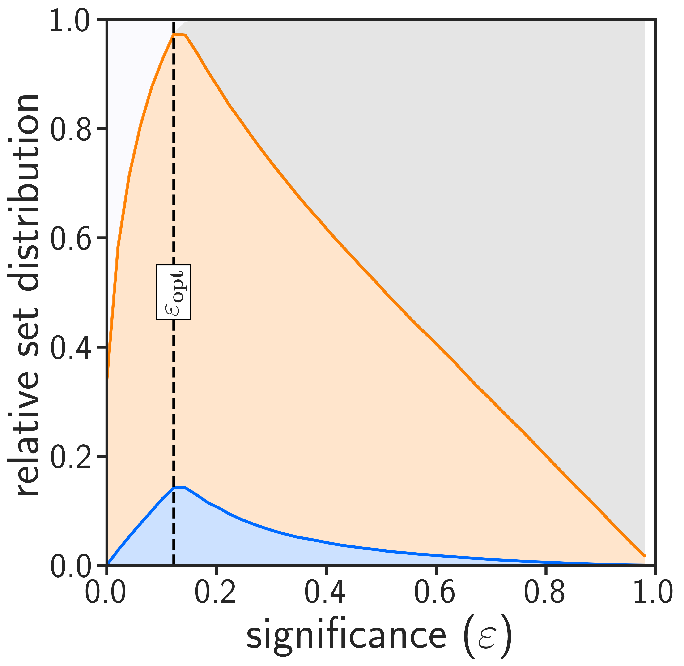
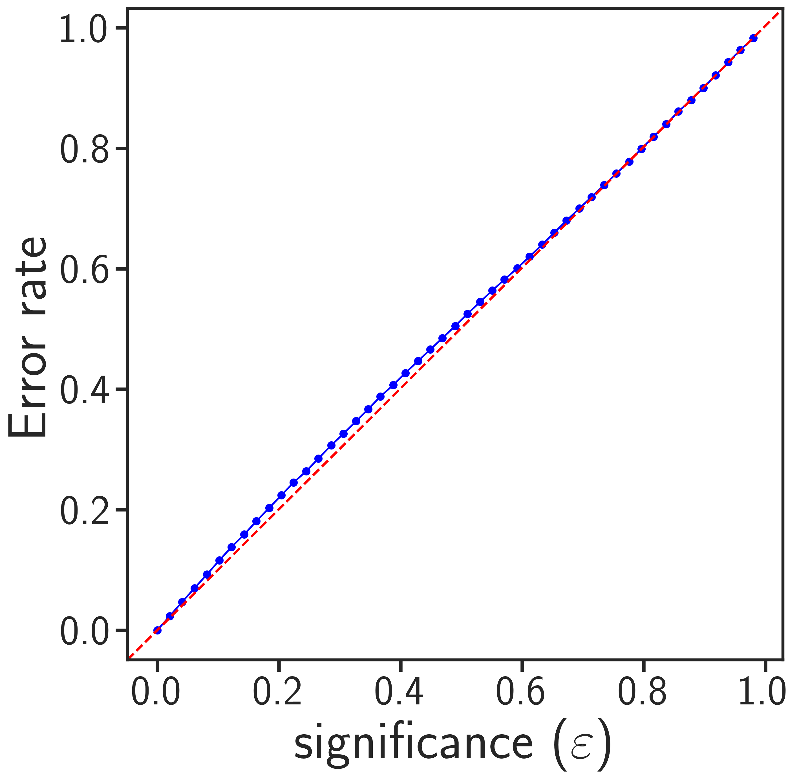
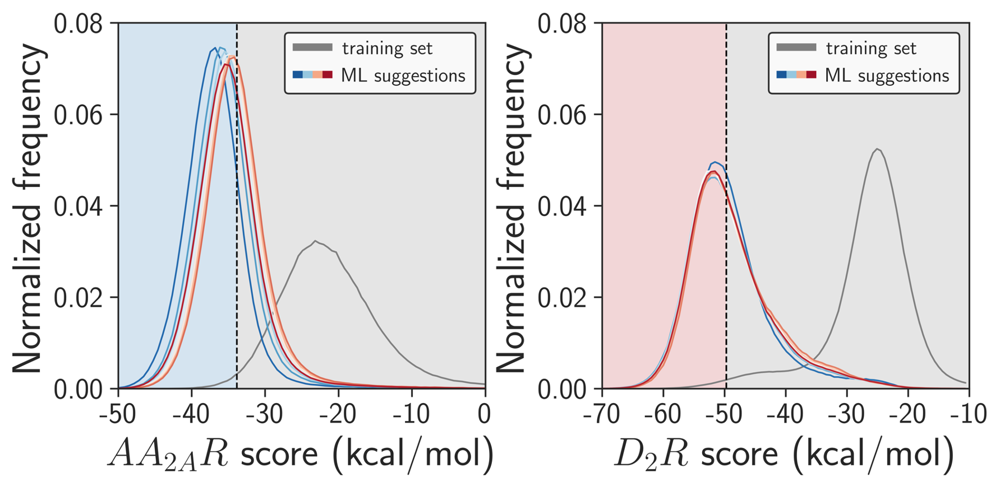

# Rapid Traversal of Ultralarge Chemical Space using Machine Learning Guided Docking Screens

### [Paper on ChemRxiv](https://doi.org/10.26434/chemrxiv-2023-w3x36)

Accelerating multi-billion-scale molecular docking screens with machine learning, by Andreas Luttens, Israel Cabeza de Vaca, Leonard Sparring, Ulf Norinder, and Jens Carlsson*.
This repository contains all code and instructions to run the method on your own protein target. We also share our ultralarge benchmarking datasets for you to compare your methods with. 
If you have any question, feel free to open an issue or reach out to us: [andreas.luttens@gmail.com](andreas.luttens@gmail.com) or [israel.cabezadevaca@icm.uu.se](israel.cabezadevaca@icm.uu.se).


The repository also contains all the scripts to analyse your predictions and generate figures.

# Large-scale Docking Datasets

If you want to train your own models with the provided data, then please download it from our [zenodo](https://zenodo.org/record/7903161) 

# Setup Environment

We will set up the environment using [Anaconda](https://docs.anaconda.com/anaconda/install/index.html). Clone the
current repository:

    git clone https://github.com/Carlssonlab/conformalpredictor.git
    
or

    git clone git@github.com:Carlssonlab/conformalpredictor.git

This is an example for how to set up a working conda environment to run the code:

    conda env create -f conformalpredictor/environment.yml
    conda activate amcp
    pip install -e conformalpredictor

Typical installation times range from 5 - 30 minutes. The software has been tested on MacOS 13.1 Ventura, CentOS 7, and Rocky Linux 9. 

# A basic example of a regular Conformal Predictor run

Once you have a training file (train_smiles_and_scores.txt) containing three columns (SMILES, moleculeID, and score) without headers, and a test file (test_smiles.txt) containing two columns (SMILES and moleculeID) without headers, you can run the following commands. The value of the optimal significance is estimated for each case during the validation step and is provided in the amcp.log file (INFO Optimal significance: XXX)

```bash
amcp_preparation -i train_smiles_and_scores.txt -o train_features.txt
amcp -m validation -i train_features.txt -o validation_result_output.txt
amcp -m train -i train_features.txt -o train_out.txt
amcp_preparation -i test_smiles.txt -o test_features.txt -pred
amcp -m predict -i test_features.txt -o test_prediction_output.txt
amcp -m analysis -i test_prediction_output.txt -o test_prediction_total.txt -sig 0.15
```

# Detailed usage

## **Step 1: Preparation**

The program requires a white space delimited file containing three columns (SMILES, moleculeID, score) without headers. 
```
COCCC(=O)Nc1ncc(s1)Br  CP000000418470  -22.99
C1CC(C(=O)NC1)SCCC=CBr  CP000000432409  -19.54
CC(C)(C)CNC(=O)c1ccsc1Br  CP000001634597  -21.29
c1c(coc1Br)C(=O)NC2CCSC2  CP000001645677  -19.28
c1c(c([nH]n1)C(=O)NCC2(CC2)N)Br  CP000001647414  -12.96
```

### Labeling of samples
The score threshold is automatically estimated by **amcp_preparation** using the top 1% as "1-class". The class imbalance can be modified using the `-p flag`. Generating a 10:90 dataset is achieved by the following command:

```bash
amcp_preparation -i unlabeled_samples.ism -o labeled_samples.ism -p 10
```

Samples can also be labeled based on an explicit score threshold by using the `-t flag`. For example:

```bash
amcp_preparation -i unlabeled_samples.ism -o labeled_samples.ism -t -25.50
```

If the samples are not labeled, **acmp_preparation** will assign all samples with a '0' dummy class. 

**NOTE**: The code does not perform a stratified split for a user's test set. 

### Featurization

Molecules (SMILES) and their scores can be transformed into input for the training step by:

```bash
amcp_preparation -i train_smiles_and_scores.txt -o train_features.txt
amcp_preparation -i train_smiles_and_scores.txt -o train_features.txt -bert    #NOT recommended because it is prohibitively slow
```

Or prepared for the prediction step by:

```bash
amcp_preparation -i test_smiles_and_scores.txt -o test_features.txt -pred
amcp_preparation -i test_smiles_and_scores.txt -o test_features.txt -pred -c 10    #(split into 10 equally sized files for parallel prediction)
```

The resulting molecular descriptor file content will look like this (in case of ECFP4 features):

```
CP001892232805_-27.90 0 0 1 0 0 1 0 0 0 0 0 0 0 0 0 ... 0 0
CP002491258647_-28.51 0 0 0 0 0 0 0 0 0 0 0 0 0 0 0 ... 0 0
CP001136835595_-34.41 0 0 0 0 0 0 0 0 0 0 0 0 0 0 0 ... 0 0
CP002361737404_-34.11 0 0 0 0 0 0 0 0 0 0 0 0 0 0 0 ... 0 0
CP000831597329_-32.93 0 0 0 0 0 1 0 0 0 0 0 0 0 0 0 ... 0 1
```

For training or predicting, the program reads a white space delimited file where the first column is the molecule ID, the second is the sample's class, and the following fields are the molecular descriptor of the sample (*i.e.*, ECFP4 fingerprints or SMILES for BERT). 
The features can be bits (ECFP4), floating point numbers (CDDD), or SMILES (BERT). **amcp_preparation** by default generates ECFP4 (1024 bits and radius 4), but can construct other descriptors by parsing **amcp_preparation** flags.
Use the `--help (-h) flag` for more information.


## **Step 2: Validation of Models**

To find the optimal significance (most single-label predictions) and fully benchmark your system, the program can be used in *validation* mode. The input file is split into K (default 5) chunks specified by the `(-vf) flag` validationFolds parameter.

Validation command examples: 

```bash
amcp -m validation -i validation_features.txt -o validation_result_output.txt
```

The program in *validation* mode will generate the following two images:

<!--  -->

 Distribution of Set Predictions  |  Valid Predictions
:-------------------------:|:-------------------------:
 |  

The optimal significance corresponds to the epsilon where the most single-label classifications occur (left image). This value relates to the performance of your models, how much information is inside your datasets and what type of errors you can expect in your test sets. Valid conformal predictors generally lead to prediction error rates (for both the minority and majority class) that correspond to the selected significance threshold (right image). If your plots show that many samples are in `both` or `null` sets at optimal significance, or that your error rates deviate from the diagonal, you should try to include more training data or provide data with less noise.

## **Step 3: Training of Models**

To train the classifiers, use the program in the *train* mode. By default, five independent CatBoost models will be generated. To adjust the number of models, use the `(-nm) flag`. Change the name of the directory where the models will be built by using the `(-md) flag`.

Training command examples:

```bash
amcp -m train -i input_train_amcp.txt -o train_out.txt
amcp -m train -i input_train_amcp.txt -o train_out.txt -nm 7
amcp -m train -i input_train_amcp.txt -o train_out.txt -md amcp_models_directory 
```

Training five CatBoost models takes around 10 minutes on a machine with 6 cores.

Parallelization in *train* mode can be achieved by building several models separately. Trained models are to be put into a common directory. The naming of the models is important.

Example to only train model number 2 (our indexing starts from 1)

```bash
amcp -m train -i train_features.txt -o train_out.txt -justmodel 2
```

## **Step 4: Predicting with Models**

To predict samples with the classifiers, use the program in the *predict* mode. The program supports use of compressed inputfiles.

Prediction command examples:

```bash
amcp -m prediction -i test_features.txt -o test_prediction_output.txt
amcp -m prediction -i test_features.txt.bz2 -o test_prediction_output.txt
```

This will write out a prediction outputfile with two header lines followed by the predicted samples. For instance, the following output example:

```
amcp_validation	test_samples	validation_file:"test_features.txt"
sampleID	real_class	p(0)	p(1)
CP001296598236_-23.39	0	0.41556937772965746	0.12869102194587417
CP000210536053_-24.77	0	0.7719261806095615	0.0095168103150632
CP001386728846_-41.38	0	0.17636899040586995	0.35040098850941304
CP003074914220_-26.24	0	0.23689406398558713	0.3333333333333333
CP002037258855_-29.03	0	0.29786095338082125	0.16
CP003012672169_-17.04	0	0.2166957792905326	0.3306332456600968
CP001013145147_-20.50	0	0.2414891107989777	0.2727272727272727
CP000015740219_-29.51	0	0.47331032545952423	0.13189965193615916
```

You can process large datasets in parallel by predicting individual chunks generated by the **amcp_prepare** program. For example:

```bash
amcp -m predict -i test_features_1.txt -o test_prediction_output_1.txt
amcp -m predict -i test_features_2.txt -o test_prediction_output_2.txt
...
amcp -m predict -i test_features_N.txt -o test_prediction_output_N.txt
```

Results from the parallel predictions can be combined in the postprocessing step.

## **Step 5: Postprocessing**

To evaluate and concatenate the predictions, use the *analysis* mode. The program support compressed inputfiles and can report back SMILES in the outputfile. The value of the optimal significance is estimated for each case during the validation step and is provided in the amcp.log file (INFO Optimal significance: XXX).

```bash
amcp -m analysis -i test_prediction_output_1.txt test_prediction_output_2.txt ... -o test_prediction_total.txt -sig 0.15
amcp -m analysis -i test_prediction_output_1.txt.bz2 test_prediction_output_2.txt.bz2 ... -o test_prediction_total.txt  -sig 0.15  #(Using bz2 compressed files)
amcp -m analysis -i test_prediction_output_1.txt test_prediction_output_2.txt ... -o test_prediction_total.txt -ism smiles.txt -sig 0.15   #(To add a smiles to column in the ouput)
```

This step will generate a single file containing molecules sorted according to their difference in p-values (p1-p0). Sorting molecules according to this metric helps further prioritize the most promising compounds in ultralarge libraries. 


```
sampleID	deltaP
CP001510102540	0.9950248756218906
CP002369699797	0.9950248756218906
CP001286743610	0.9950248756218906
CP001665495687	0.9950248756218906
CP001286743610	0.9950248756218906
CP002548396619	0.9950248756218906
CP002294527005	0.9950248756218906
```

using the `(-ism) flag` will create the following type of output:

```
smiles	sampleID	deltaP
c1cc(ccc1NC(=O)C(=O)NNc2c(cc(cn2)Cl)Cl)n3cnnn3	CP001510102540	0.9950248756218906
Cc1ccc(cc1Br)NC(=O)C(=O)NNC(=O)C(=O)N2CCCC2	CP002369699797	0.9950248756218906
Cc1ccc(cc1OCc2cccc(c2)Cl)NC(=O)C(=O)N3CCOCC3	CP001286743610	0.9950248756218906
Cc1cc(ccc1n2cnnn2)NCc3ccc(cc3)OC	CP001665495687	0.9950248756218906
Cc1ccc(cc1OCc2cccc(c2)Cl)NC(=O)C(=O)N3CCOCC3	CP001286743610	0.9950248756218906
```

Explicit evaluation of molecules with large deltaP values hopefully leads to improved score distributions. For example A2AR and D2R systems:

<!--  -->



The final file test_prediction_total.txt (sampleID, deltaP) contains just the molecules considered virtual actives sorted by their difference in p-values (p1-p0).

# Citation
If you use this method in your research, please cite our work as follows:

    @misc{Luttens_Vaca_Sparring_Norinder_Carlsson_2023, 
          title={Rapid traversal of ultralarge chemical space using machine learning guided docking screens}, 
          url={https://chemrxiv.org/engage/chemrxiv/article-details/6456778807c3f02937503688}, 
          journal={ChemRxiv}, 
          author={Luttens, Andreas and Cabeza de Vaca, Israel and Sparring, Leonard and Norinder, Ulf and Carlsson, Jens}, 
          year={2023}, 
          month={May}} 

# License
MIT

# Feedback
Please let us know how we can make our method more user friendly!
